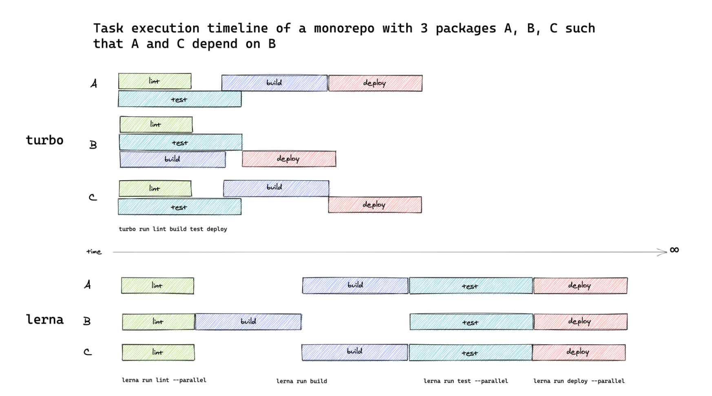

# monorepo-project

基于 turborepo 开发项目。

# Monorepo

## 什么是 Monorepo?

Monorepo 是一种项目管理方式，在 Monorepo 之前，代码仓库管理方式是 MultiRepo，即每个项目都对应着一个单独的代码仓库每个项目进行分散管理
这就会导致许多弊端，例如可能每个项目的基建以及工具库都是差不多的，基础代码的重复复用问题等等...

Monorepo 就是把多个项目放在一个仓库里面, 目前可以搭建 Monorepo 的工具也很多，例如：

| 工具                                | 简述                                                   |
| ----------------------------------- | ------------------------------------------------------ |
| [Bit](https://bit.dev/)             | 用于组件驱动开发的工具链                               |
| [Turborepo](https://turborepo.org/) | 用于 JavaScript 和 TypeScript 代码库的高性能构建系统。 |
| [Rush](https://rushjs.io/)          | 一个可扩展的 web 单仓库管理器。                        |
| [Nx](https://nx.dev/)               | 具有一流的 Monorepo 支持和强大集成的下一代构建系统。   |
| [Lerna](https://www.lernajs.cn/)    | 用于管理包含多个软件包的项目                           |

## 为什么使用 Monorepo？

目前研发代码的增多，工程日益复杂，代码复用和版本管理显得格外的繁琐，版本升级没有日志，互相依赖的包也要手动管理版本，以往的组件库独立开发的方式并没有很好的区分是组件和组件之前的关系，往往只需要一种类型的组件，例如 echarts，公司项目就得不得不安装一整个组件库，没有对组件很好的进行区分，哪些是功能组件，哪些是业务组件等，造成组件库越来越大，编译运行打包等效率降低，每次一个小改动就得重新 npm run dev，有时候还会热更新失效，必须重新启动才能看到一整个的预览效果，还有下面几个相关痛点

- 组件耦合严重，组件代码量大
- 业务开发分工不明确，业务开发人员要关心非业务的代码
- 编译慢，效率低。(mac 还行，windows 过慢)
- 管理、调试、追踪 `bug` 困难
- 不同项目之间 `node`、`node-sass`、`webpack` 等基础依赖版本不统一，切换增加心智负担
- 不同项目可能存在技术栈不统一，如：状态管理，`less`,`sass`
- 分支管理混乱
- 多包多项目之间依赖关系复杂
- 第三方依赖库版本可能不一致
- 不利于团队协作
- 无法针对主应用统一跑测试用例,发布时很难避免一些基本的错误发生
- 需要频繁切换项目
- 搭建独立的文档系统和其他子应用时，相关依赖又要单独管理，又有上述的症状
  针对上述问题我们引入了 `Monorepo` 的概念，把以往的单一组件库拆分为职责更细化的包，架构更清晰，解耦，子应用隔离

## 使用 pnpm Workspace

使用 pnpm Workspace 在 Monorepo 架构之上，pnpm 能极大发挥它的作用，相比 yarn 和 npm，pnpm 能节约磁盘空间并且提升安装速度，当前很多前端团队和大部分主流开源项目抛弃 Npm，Yarn，开始接入 Pnpm。当前 pnpm 版本使用的是 8.15.4，node 版本需要 20.0.0+，具体看官网有详情参数和 api。

## 什么是 Turborepo

TurboRepo 是构建 Javascript，Typescript 的 Monorepo 高性能构建系统,Turborepo 抽象出所有烦人的配置、脚本和工具，减少项目配置的复杂性，可以让我们专注于业务的开发

我们通常在构建 Monorepo 时需要搭配适当的工具来扩展 monorepo，Turborepo 利用先进的构建技术和思想来加速开发，构建了无需配置复杂的工作，只需要我们通过脚本和工具，即可快速搭建 Monorepo, TurboRepo 支持使用 Yarn Npm Pnpm。该项目使用 Pnpm 构建

## TurboRepo 的优势

### 多任务并行处理

Turbo 支持多个任务的并行运行，我们在对多个子包，编译打包的过程中，turbo 会同时进行多个任务的处理

在传统的 Monorepo 任务运行器中，就像`lerna`或者`yarn`自己的内置`workspaces run`命令一样，每个项目的 script 生命周期脚本都以[拓扑](https://turborepo.org/docs/glossary#topological-order)方式运行（这是“依赖优先”顺序的数学术语）或单独并行运行。根据 Monorepo 的依赖关系图，CPU 内核可能处于空闲状态——这样就会浪费宝贵的时间和资源。[](https://turborepo.org/docs/glossary#topological-order)

> 什么是拓扑 ？ </br>
> 拓扑 [Topological Order](https://turborepo.org/docs/glossary#topological-order)
> 是一种排序 拓扑排序是依赖优先的术语， 如果 A 依赖于 B，B 依赖于 C，则拓扑顺序为 C、B、A。
>
> 比如一个较大的工程往往被划分成许多子工程，我们把这些子工程称作**活动**(activity)。在整个工程中，有些子工程(活动)必须在其它有关子工程完成之后才能开始，也就是说，一个子工程的开始是以它的所有前序子工程的结束为先决条件的

为了可以了解`turbo`多么强大，下图比较了`turbo`vs`lerna`任务执行时间线：



`Turbo`它能够有效地安排任务类似于瀑布可以同时异步执行多个任务，而`lerna`一次只能执行一项任务 所以`Turbo`的 性能不言而喻。

### 更快的增量构建

如果我们的项目过大，构建多个子包会造成时间和性能的浪费，turborepo 中的缓存机制 可以帮助我们记住构建内容 并且跳过已经计算过的内容，优化打包效率。

### 云缓存

Turbo 通过其远程缓存功能可以帮助多人远程构建云缓存实现了更快的构建。

### 任务管道

用配置文件定义任务之间的关系，然后让 Turborepo 优化构建内容和时间。

### 基于约定的配置

通过约定降低复杂性，只需几行 JSON 即可配置整个项目依赖，执行脚本的顺序结构。

### 浏览器中的配置文件

生成构建配置文件并将其导入 Chrome 或 Edge 以了解哪些任务花费的时间最长。

## Turbo 核心概念

## 管道 （Pipeline）

Turborepo 为开发人员提供了一种以常规方式显式指定任务关系的方法。

1. 新来的开发人员可以查看 Turborepo`pipeline`并了解任务之间的关系。
2. `turbo`可以使用这个显式声明来执行基于多核处理器的丰富可用性的优化和计划执行。

`turbo`在定义 Monorepo 的任务依赖关系图，我们需要在根目录定义`turbo.json` 执行各种调度，输出，缓存依赖， 打包等功能

`turbo.json`位于 turborepo 项目根目录

在`pipeline`中的每一个 key 都指向我们在`package.json`中定义的 script 脚本执行命令,并且在`pipeline`中的每一个 key 都是可以被`turbo run`所执行 执行[`pipeline`](https://turborepo.org/docs/features/pipelines)的脚本的名称。您可以使用其下方的键以及与[缓存](https://turborepo.org/docs/features/caching)相关的一些其他选项来指定其依赖项。

在我们执行`turbo run ***`命令的时候 turbo 会根据我们定义的 [Pipelines](https://turborepo.org/docs/core-concepts/pipelines)
里对命令的各种配置去对我们的每个**package**中的`package.json 中 对应的script`执行脚本进行有序的执行和缓存输出的文件。

```js
{
  "$schema": "https://turbo.build/schema.json",
  "globalDotEnv": [
    ".env"
  ],
  "pipeline": {
    "defaultProject#dev": {
      "dependsOn": [
        "@limuen/viteconfig#dev"
      ],
      "cache": false,
      "persistent": true,
      "dotEnv": [
        ".env.development.local",
        ".env.development",
        ".env.local",
        ".env"
      ]
    },
    "defaultProject#build": {
      "dependsOn": [
        "@limuen/viteconfig#build"
      ],
      "outputs": [
        "dist/**"
      ],
      "dotEnv": [
        ".env.development.local",
        ".env.development",
        ".env.local",
        ".env"
      ]
    },
    "dev:alipay": {
      "dependsOn": [
        "^dev:alipay"
      ],
      "persistent": true,
      "cache": false
    },
    "build:alipay": {
      "dependsOn": [
        "^build:alipay"
      ],
      "outputs": []
    },
    "dev": {
      "cache": false,
      "persistent": true,
      "dotEnv": [
        ".env.development.local",
        ".env.development",
        ".env.local",
        ".env"
      ]
    },
    "build": {
      "dependsOn": [
        "^build"
      ],
      "outputs": [
        "dist/**"
      ],
      "dotEnv": [
        ".env.production.local",
        ".env.production",
        ".env.local",
        ".env"
      ]
    },
    "test": {
      "dependsOn": [
        "^test"
      ],
      "outputs": [
        "dist/**"
      ],
      "dotEnv": [
        ".env.test.local",
        ".env.test",
        ".env.local",
        ".env"
      ]
    },
    "lint": {
      "dependsOn": []
    }
  }
}
```

### 拓扑依赖

可以通过`^`符号来显式声明该任务具有拓扑依赖性，需要依赖的包执行完相应的任务后才能开始执行自己的任务

```
{
    "turbo": {
        "pipeline": {
            "build": {
                "dependsOn": ["^build"],
            }
        }
    }
}
```

因为 apps/defaultProject 依赖于@limuen/viteconfig，所以我们当前 defaultProject 子包的 build 存在依赖关系，根据 build 的 dependsOn 配置，会先执行依赖项的 build 命令，也就是@limuen/viteconfig 的 build 命令，依赖项执行完后才会执行 defaultProject 的 dev 命令。因为它是依赖@limuen/viteconfig启动的。
如果我们不添加`"dependsOn": ["^build"]`数组中的`‘^’`那么就代表我们当前只需要执行我们自己的 build 命令

## 命令行的使用

### `--filter`

指定包/应用程序、目录和 git 提交的组合作为执行的入口点。

可以组合多个过滤器来选择不同的目标集。此外，过滤器还可以排除目标。匹配任何过滤器且未明确排除的目标将在最终入口点选择中。

有关`--filter`标志和过滤的更多详细信息，请参阅[我们文档中的专用页面](https://turborepo.org/docs/core-concepts/filtering)

```js
pnpm run dev --filter [name] # name 为项目名称
pnpm run build --filter [name] # name 为项目名称
pnpm add [packageName] --filter [name] # packageName 为包名，name 为项目名称
pnpm add [packageName] --filter [packageName] # 第一个 packageName 要安装的包名 第二个是在他下面的package.json安装第一个 packageName的依赖
```

### `--force`

忽略现有的缓存工件并强制重新执行所有任务（覆盖重叠的工件）

```js
turbo run build --force
```

### `--no-cache`

默认`false`。不要缓存任务的结果。`next dev`这对于诸如 or 之类的监视命令很有用`react-scripts start`。

```js
turbo run build --no-cache
turbo run dev --parallel --no-cache
```

### `--only`

默认`false`。将执行限制为指定 package 中的指定的任务。这与默认情况下如何`lerna`或`pnpm`运行任务的方式非常相似。如果我们指定了 在依赖前需要执行 build 命令 但是如果我们设置 `--only` 将默认排除 `build`命令

鉴于此管道`turbo.json`：

```json
{
  "$schema": "https://turborepo.org/schema.json",
  "pipeline": {
    "build": {
      "dependsOn": ["^build"]
    },
    "test": {
      "dependsOn": ["^build"]
    }
  }
}
```

```js
turbo run test --only
```

将只会执行每个包中的`test`任务。它不会`build`。

介绍几种常用的 `turbo` 命令, 当然 `turbo` 提供了许多在命令行中使用的指令， 具体可以查看

[命令行参考](https://turborepo.org/docs/reference/command-line-reference)

## 参考

- [Turborepo](https://turborepo.org/docs/getting-started)
- [Pnpm](https://pnpm.io/zh/)

## 安装依赖和运行

```bash
# 运行所有项目
$ pnpm run dev
# 运行指定名称项目
$ pnpm run dev --filter [name] # name 为项目名称

# 打包所有项目
$ pnpm run build
# 打包指定名称项目
$ pnpm run build --filter [name] # name 为项目名称
```

## 项目目录结构

```text
monorepo-project
├─ apps                    # 项目文件
│  └─ defaultProject       # 构建viteDemo
│  └─ miniLocalLiftProject # Taro小程序Demo
│  └─ react-low-code       # react低代码平台
├─ packages                # 项目公共库
│  ├─ viteconfig           # vite库的配置
│  ├─ utils                # 常用公共的方法文件
│  ├─ tsconfig             # tsconfig的公共配置
│  ├─ request              # axios请求库的公共配置(仅限PC端)
│  ├─ stores               # 基于zustand状态公共管理库
├─ turbo                   # plop
│  ├─ generators           # 模板列表
│  │  └─ react-components  # packages/components 下的模板
├─ .commitlintrc.js        # git 提交配置
├─ .eslintrc.js            # ESLint 校验配置
├─ .gitignore              # git 提交忽略
├─ package.json            # 依赖包管理
├─ pnpm-lock.yaml          # pnpm 安装依赖锁文件
├─ pnpm-workspace.yaml     # pnpm 工作空间配置
├─ README.md               # 项目介绍
├─ tsconfig.json           # typescript 全局配置
└─ turbo.json              # turbo 配置文件
```

## 致谢

- [ADNY](https://github.com/ErKeLost)大佬在monorepo上的帮助
